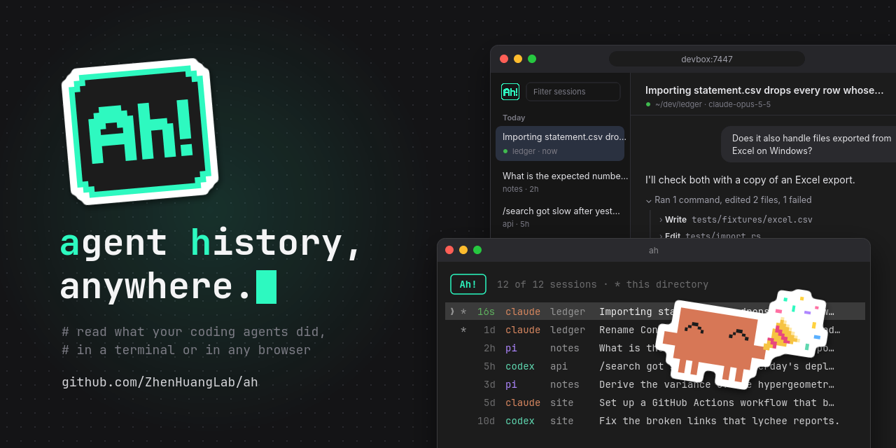
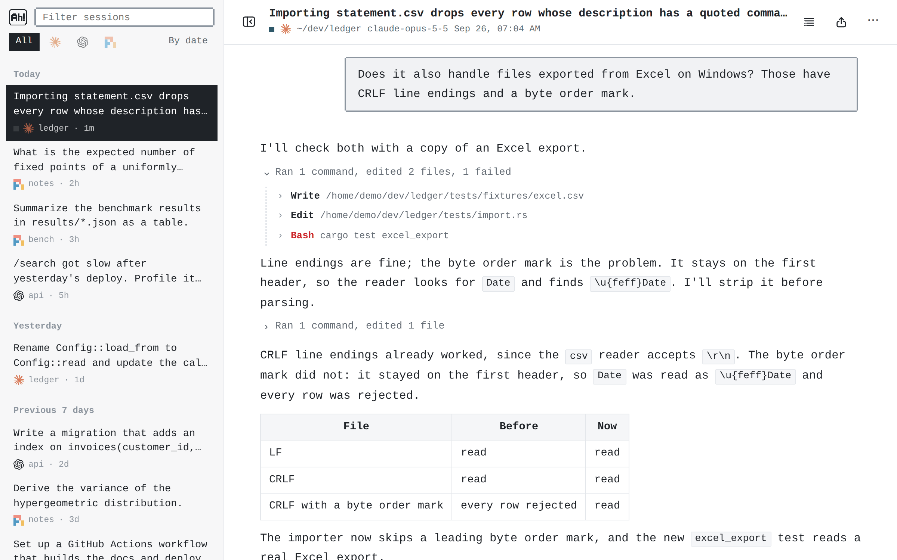
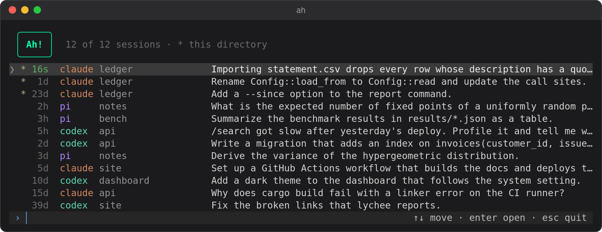
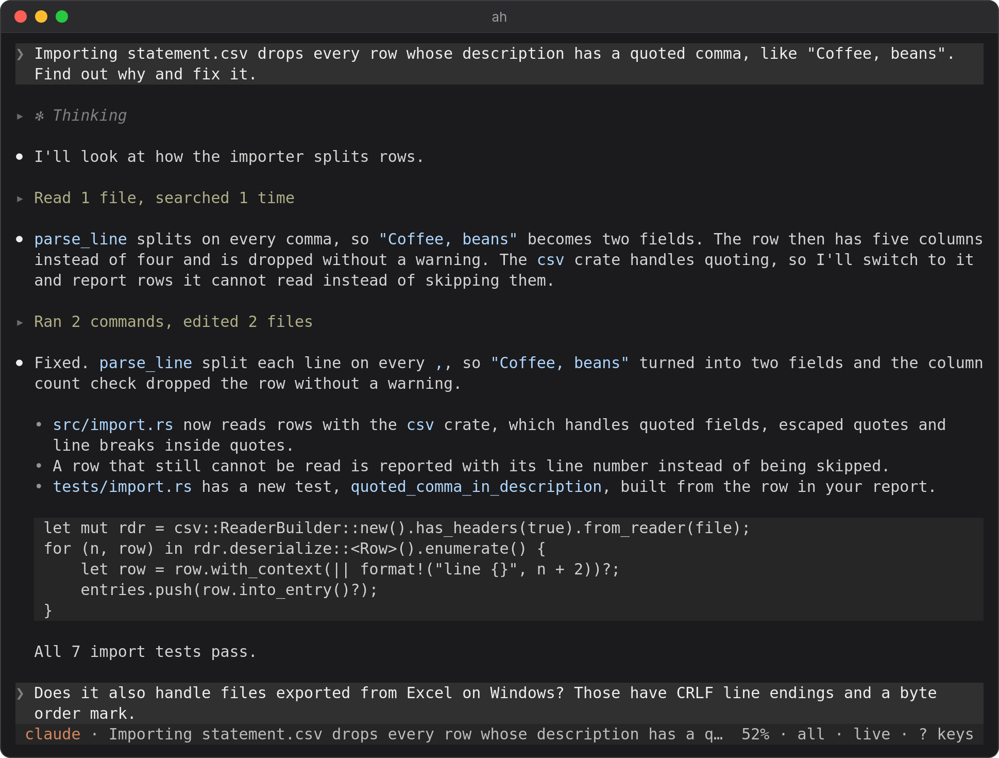
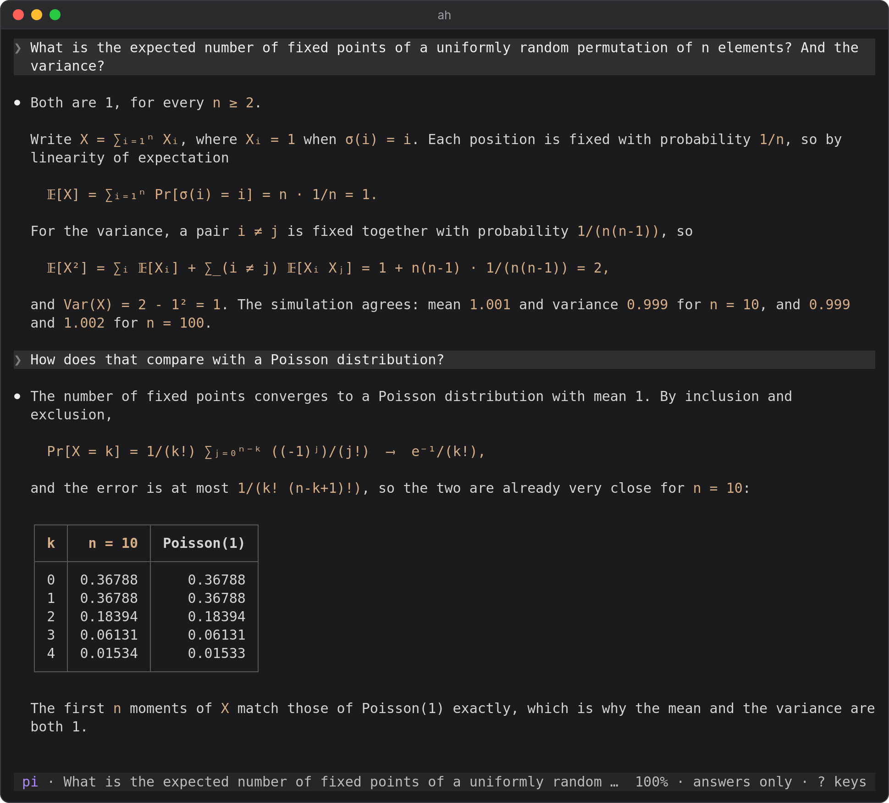
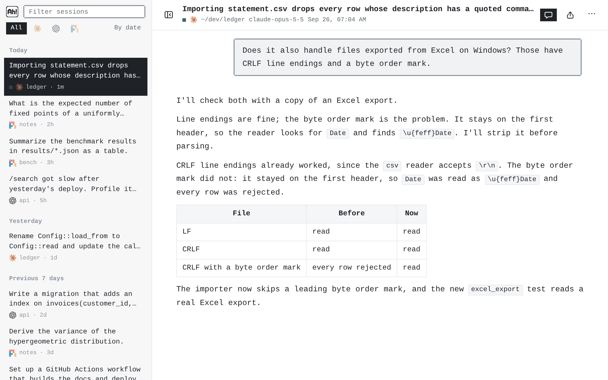
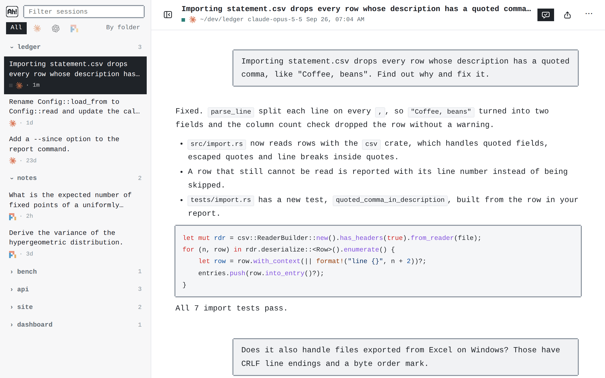
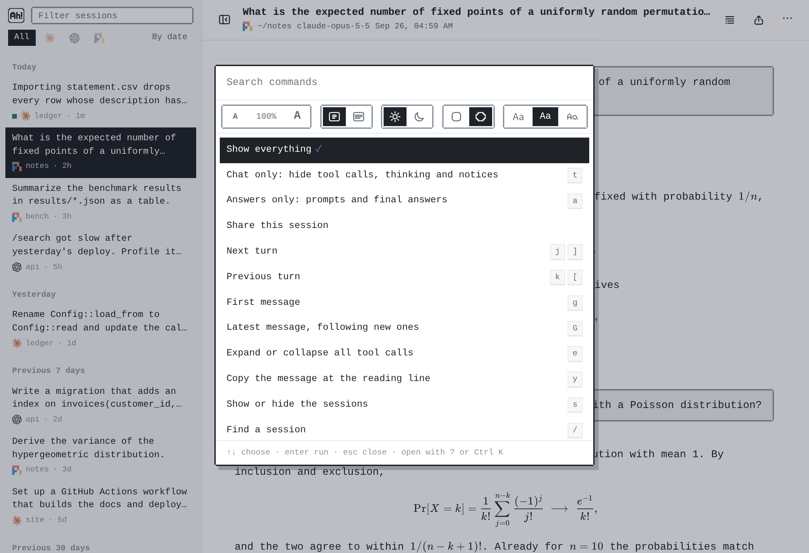
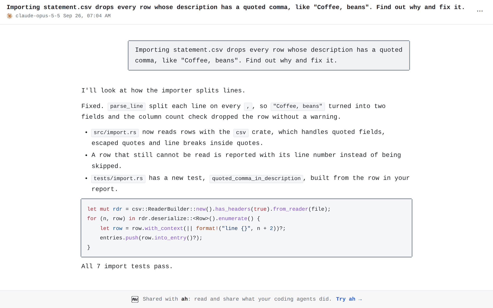

<p align="center">
  
</p>

<h1 align="center">ah</h1>

<p align="center">
  Agent history: read and share Claude Code, Codex and pi sessions, in the terminal
  or in a browser anywhere.
</p>

<p align="center">
  <a href="LICENSE"></a>
  
  
</p>

<p align="center"><b>English</b> · <a href="README.zh-CN.md">简体中文</a></p>

<picture>
  <source media="(prefers-color-scheme: dark)" srcset="docs/all-dark.png">
  
</picture>

`ah` finds every session of the three agents on this machine and shows the whole
transcript, including everything before a context compaction. Tool calls and
thinking fold into one summary line between messages. The chat view hides them
entirely, and the answers view shows only your prompts and the last message of
each turn, leaving out the notes agents write between tool calls. Both the
terminal and the browser follow the transcript file, so a running session
updates as the agent writes.

## Install

Each [release](https://github.com/ZhenHuangLab/ah/releases) has binaries for
macOS (Apple Silicon and Intel) and Linux (x86_64 and ARM64). The Linux ones are
statically linked and run on any distribution. To put the latest one in
`~/.local/bin`:

```sh
target=aarch64-apple-darwin  # or x86_64-apple-darwin, x86_64-unknown-linux-musl, aarch64-unknown-linux-musl
mkdir -p ~/.local/bin
curl -fsSL https://github.com/ZhenHuangLab/ah/releases/latest/download/ah-$target.tar.gz | tar xz -C ~/.local/bin ah
```

macOS blocks a binary downloaded in a browser; `xattr -d com.apple.quarantine ah`
allows it. To build from source instead:

```sh
cargo install --git https://github.com/ZhenHuangLab/ah
```

The binary embeds the web front end, including KaTeX and highlight.js, so it
works offline.

## Terminal

```sh
ah                 # pick a session; this directory's sessions come first
ah e671b1          # open a session by id or unique id prefix
ah path/to.jsonl   # open any transcript, including subagent ones
```



In the list, type to filter and press Enter to open. A session opens with its
thinking and tool calls folded:



In a session:

| Keys | |
|---|---|
| `j` `k`, `space` `b`, `ctrl-d` `ctrl-u` | scroll |
| `g` `G` | top, bottom (bottom keeps following new messages) |
| `[` `]` | previous, next prompt |
| `t` | chat only: hide tool calls, thinking and notices |
| `a` | answers only: prompts and the final answer of each turn |
| `tab` `enter`, click | move between folds, open or close one |
| `e` | expand or collapse all |
| `/` `n` `N` | search |
| `y` | copy the message, or the focused tool call |
| `s` | share the chat or the answers by a link (see [Sharing a session](#sharing-a-session)) |
| drag | select text and copy it |
| `q` | back to the list |

Copying uses OSC 52, which reaches your local clipboard over SSH. Inside tmux,
set `set -g set-clipboard on`.

Math is shown as Unicode (`ϕᵢⱼ(q) = 2πq·(dᵢ - dⱼ)`) rather than TeX source, as
in this pi session in the answers view:



## Browser

```sh
ah serve
```

This listens on the machine's Tailscale addresses (IPv4 and IPv6) and on
127.0.0.1, port 7447, so any device on the tailnet can open
`http://<machine>:7447/`. Use
`--addr IP:PORT` (repeatable) to choose other addresses. There is no login, so
the server only answers requests that name it by IP address, `localhost` or its
Tailscale name (`machine` or `machine.<tailnet>.ts.net`); this keeps web pages
from reaching it through DNS rebinding.

The page renders Markdown and math, folds tool calls (details load when opened),
and updates live. Sessions of more than two turns get a rail of their turns on
the right that previews each turn on hover and jumps on click. The button in the
header shows the current view as an icon (rows, a speech bubble, a bubble with a
check mark) and switches to the next: everything, chat only, answers only (`t`,
`a`). Chat only hides tool calls, thinking and notices:

<picture>
  <source media="(prefers-color-scheme: dark)" srcset="docs/chat-dark.png">
  
</picture>

Answers only keeps your prompts and the final answer of each turn. Here the
session list is grouped by folder:

<picture>
  <source media="(prefers-color-scheme: dark)" srcset="docs/answers-dark.png">
  
</picture>

Press `?` or Ctrl-K, or click ⋯, for a list of all commands with their keys; type
to filter it, and pick one with the arrow keys and Enter or with the mouse.
Buttons above the commands set the text size of the conversation (`+`, `-`),
switch between a centered column and the full width of the window (`w`), and pick
the light or dark theme, the style, and the font. The pixel style, the default,
draws square edges in pixels with hard shadows and shows what is selected in
inverted colors; the minimal style has rounded edges and soft highlights. The font
of the page and the conversation is monospace by default, or sans-serif or pixel.

<picture>
  <source media="(prefers-color-scheme: dark)" srcset="docs/palette-dark.png">
  
</picture>

The session list is grouped by date, or by folder under headers that open and
close ("By date" switches). The button at the top left or `s` hides and shows it,
and dragging its edge changes its width; dragging the edge most of the way to the
left hides it. The mark above it links to this repository. On a phone it opens as
a drawer.

Copying a selection gives Markdown: formulas as TeX, code as fenced blocks, and
lists, tables and emphasis in Markdown syntax. The copy icon under a message
copies its Markdown source; beside it is the time the message was written, in
the browser's time zone.

To keep it running, as a systemd user service:

```ini
# ~/.config/systemd/user/ah.service
[Unit]
Description=ah: web viewer for Claude Code, Codex and pi sessions
After=network-online.target

[Service]
ExecStart=%h/.local/bin/ah serve
Restart=always
RestartSec=5

[Install]
WantedBy=default.target
```

```sh
systemctl --user enable --now ah
loginctl enable-linger "$USER"   # keep it running while logged out
```

With Cargo, `ah` is in `~/.cargo/bin` instead. `ah serve` exits when the machine
has no Tailscale address and no public host name (below), and systemd retries
until an address appears.

## Access from anywhere

`ah serve` can also answer on a host name of your own through
[Cloudflare Tunnel](https://developers.cloudflare.com/cloudflare-one/networks/connectors/cloudflare-tunnel/),
over HTTPS and without opening a port. Browsers there sign in with a link; the
tailnet and 127.0.0.1 need no sign-in, as before.

1. In the Cloudflare dashboard, under Networking › Tunnels, create a tunnel and
   give it a public hostname, such as `ah.example.com`, whose service is
   `http://localhost:7448`.
2. Install `cloudflared` and run the tunnel as a service with its token:
   `sudo cloudflared service install <token>`.
3. Name the host in `~/.config/ah/config.toml` and restart `ah serve`:

   ```toml
   [public]
   host = "ah.example.com"
   ```

`ah serve` then also listens on 127.0.0.1:7448 for the tunnel, and runs without a
Tailscale address.

To sign in, run `ah login` on the machine. It prints a link, with a QR code for a
phone, that works for 10 minutes; a browser that opens it and confirms stays
signed in for 30 days. A browser on the tailnet, or one already signed in, shows such a link for
another device with "Sign in on another device" in the command list. Deleting
`~/.local/share/ah/key` and restarting `ah serve` signs every browser out.

### Sharing a session

With a public host name, the share button at the top right of a session, or `s`
in the terminal, makes a link to the session as it is now. The link shows the
chat (the prompts and the agent's messages) or the answers (the prompts and the
final answer of each turn); tool calls, thinking and the session's folder never go
into it. It works for 1, 7 or 30 days, or until you stop it. Read what you share
first: prompts and answers can contain keys, tokens or private paths.

<picture>
  <source media="(prefers-color-scheme: dark)" srcset="docs/share-dark.png">
  
</picture>

Whoever opens the link sees the conversation without the session list, and search
engines are asked not to index it. The share dialog lists the session's open links
and stops them; `ah share list` and `ah share stop <id>` do the same for all
sessions. Each link's snapshot is kept in `~/.local/share/ah/shares`, so it stays
readable after the agent deletes the transcript, for as long as `ah serve` runs.

## Where sessions come from

| Agent | Location | Override |
|---|---|---|
| Claude Code | `~/.claude/projects/*/*.jsonl` | `CLAUDE_CONFIG_DIR` |
| Codex | `~/.codex/sessions/`, `~/.codex/archived_sessions/` | `CODEX_HOME` |
| pi | `~/.pi/agent/sessions/*/*.jsonl` | `PI_CODING_AGENT_SESSION_DIR`, `PI_CODING_AGENT_DIR` |

Subagent transcripts are left out of the lists; open them by path. Transcripts
are shown in file order. When a pi session goes back to an earlier point with
`/tree`, the abandoned branch stays visible and a notice marks where the
conversation resumes.

## License

MIT; see [LICENSE](LICENSE). `assets/vendor` contains KaTeX (MIT), highlight.js
(BSD-3-Clause) and the Pixelify Sans font (SIL Open Font License 1.1) with their
license files. The screenshots show
invented sessions.

## Acknowledgments

Thanks to the <a href="https://linux.do/"><picture><source media="(prefers-color-scheme: dark)" srcset="docs/linuxdo-dark.png"></picture></a> community for its support and feedback.
